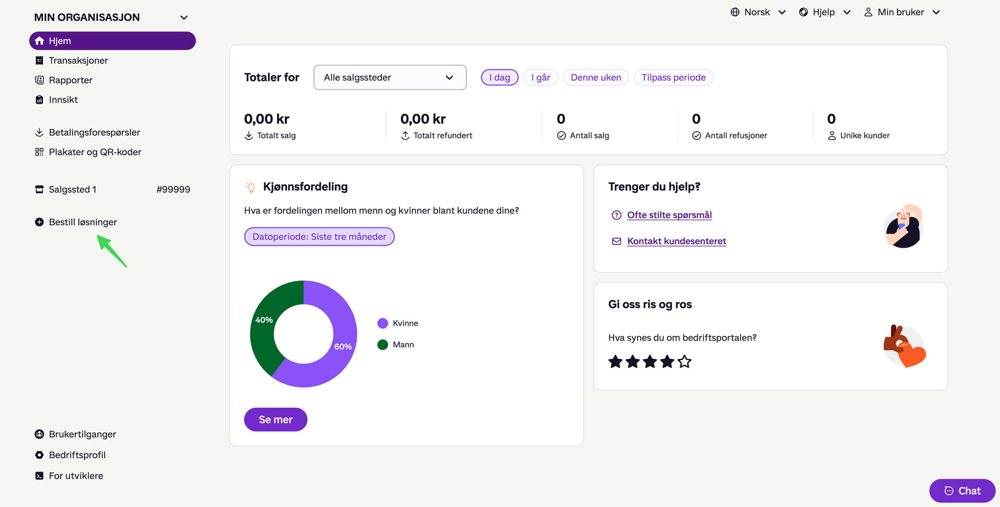
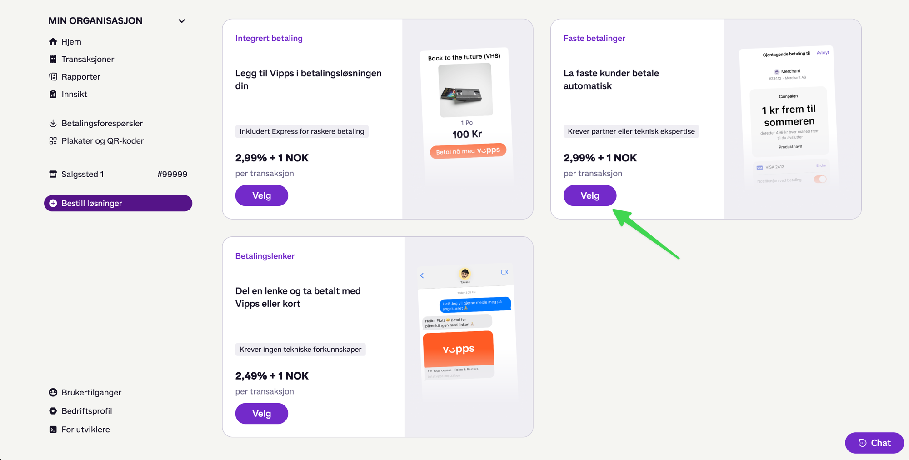
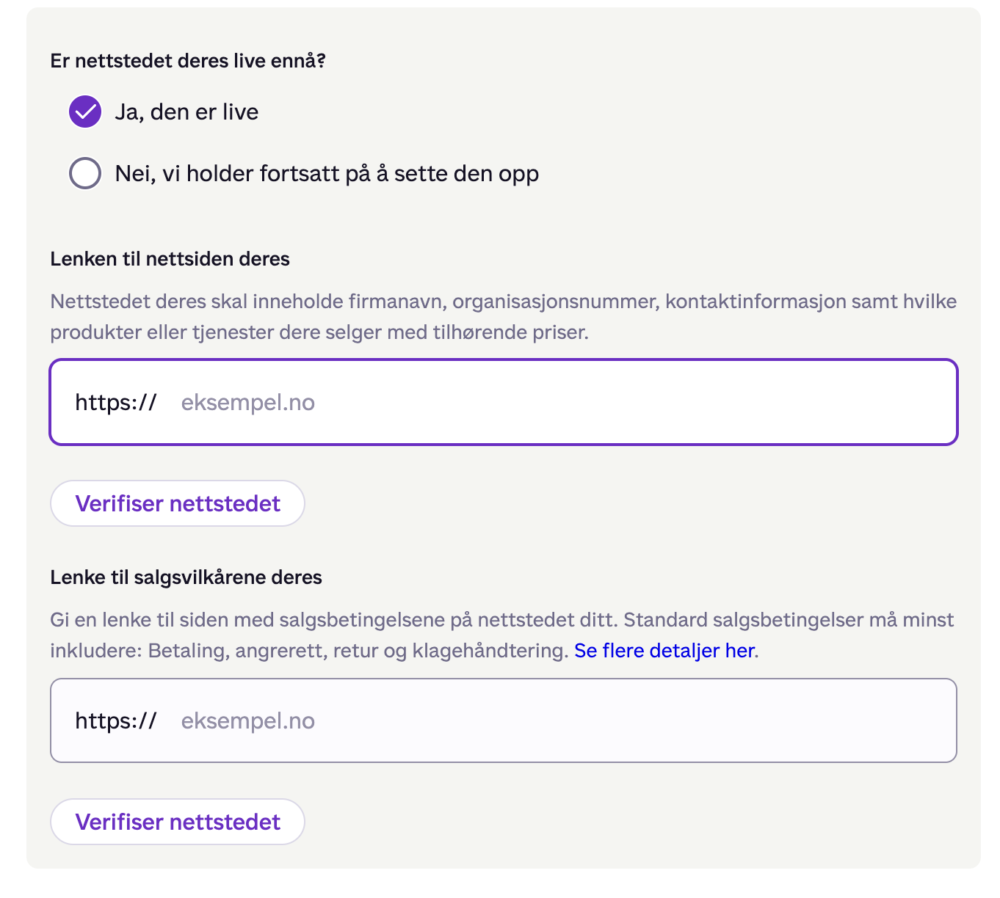

# Vipps portal walkthrough — recorded session

> **Status: in progress.** A real click-through of portal.vippsmobilepay.com,
> recorded screen by screen with screenshots, to verify and correct the
> click-path assumed in [`../vipps-org-onboarding.md`](../vipps-org-onboarding.md)
> (open question 6) and to collect what implementation needs: the **MSN**,
> **test API keys**, and the exact **Faste betalinger** ordering flow.
>
> Recorded 2026-07-28 with Håkon's dashboard access. Screenshots live in
> [`images/`](images/). Each step notes what the checklist assumed vs. what the
> portal actually shows.

## What we are extracting from this session

| # | Goal | Needed for |
|---|------|------------|
| 1 | Actual portal navigation & wording (Norwegian labels) | In-product onboarding guide for org admins |
| 2 | State of this org's agreement: existing sales units & products | Branch A vs B in the checklist (add to existing unit vs. new product) |
| 3 | The **Faste betalinger** order flow incl. compliance questions, verbatim | Checklist step B copy; open questions 3 & 6 |
| 4 | **MSN** of the sales unit carrying Faste betalinger | All API calls (`Merchant-Serial-Number` header), webhook registration |
| 5 | **Test keys** (client_id / client_secret / Ocp-Apim-Subscription-Key for apitest.vipps.no) | Implementation against the test environment |
| 6 | Where production keys live and who can see them | Org connect flow in støttemedlem (checklist step C) |

**Never commit secrets:** screenshots must not show client secrets or
subscription keys unredacted, and key values go in `.env`/secret storage —
only *where to find them* is recorded here.

**No real org data:** screenshots and log text must not contain the real
organization's names, sales-unit names/numbers, or org ids — use anonymized
captures (placeholder names like `Salgssted 1 #99999`) or redact before
committing. These images feed the public-facing onboarding guide.

## Session log

<!-- One entry per screen. Format:

### Step N — <what we did>

- **Where:** <URL / menu path>
- **What the portal shows:** <observations, verbatim Norwegian labels>
- **Checklist delta:** <matches vipps-org-onboarding.md? what to correct?>
-->

### Step 1 — Log in

*(no screenshot — standard login page)*

- **Where:** https://portal.vippsmobilepay.com/login
- **What the portal shows:** the standard Vipps MobilePay portal login.
- **Checklist delta:** none — checklist step B.1 ("Log in to
  portal.vippsmobilepay.com") holds; the login URL is `/login`.

### Step 2 — Home dashboard after login

*(screenshot anonymized: sales-unit names/numbers and org id are placeholders)*

- **Where:** portal home ("Hjem") right after login. Org selector top-left:
  **"MIN ORGANISASJON"** dropdown (switches org if the user has several).
- **What the portal shows (left menu, verbatim):**
  - *Hjem*, *Transaksjoner*, *Rapporter*, *Innsikt*
  - *Betalingsforespørsler*, *Plakater og QR-koder*
  - The org's existing **sales units listed by name + number** directly in the
    menu (e.g. `Salgssted 1 #99999`) — this org's units are **Vippsnummer**
    (in-person) sales units, i.e. it matches the checklist's "only takes Vipps
    in person" branch.
  - **`+ Bestill løsninger`** ← the entry point for ordering new products.
    Hovering it shows the target URL `portal.vippsmobilepay.com/<orgId>/products`
    — so product ordering is a per-org *products* page.
  - Bottom: *Brukertilganger* (user access), *Bedriftsprofil* (company
    profile), ***For utviklere*** (For developers — expect API keys/MSN here,
    relevant for step C of the checklist).
- **Dashboard body:** totals for "Alle salgssteder" (sales-site picker +
  period chips *I dag / I går / Denne uken / Tilpass periode*), a
  "Kjønnsfordeling" insight widget, help box ("Trenger du hjelp?"), feedback
  box. Not relevant to ordering.
- **Checklist delta:** checklist step B.2 says *"choose 'Add' next to
  Recurring Payments on that sales unit"* or *"order Faste betalinger as a new
  product"* — the portal's actual wording for the ordering entry point is
  **"Bestill løsninger"** in the left menu (not an "Add" button on the sales
  unit, at least not from Home). Checklist copy should say: *click
  "Bestill løsninger" in the left menu*. The existing units here are
  Vippsnummer-type, so this session follows the **new-product branch**.

### Step 3 — "Bestill løsninger" products page

- **Where:** left menu → **Bestill løsninger** (`/<orgId>/products`).
- **What the portal shows:** product **cards**, each with a name, one-line
  pitch, a qualifier badge, per-transaction price, and a **"Velg"** button.
  Three cards visible for this org (verbatim):
  | Card | Pitch | Badge | Price |
  |------|-------|-------|-------|
  | *Integrert betaling* | "Legg til Vipps i betalingsløsningen din" | "Inkludert Express for raskere betaling" | 2,99 % + 1 NOK per transaksjon |
  | ***Faste betalinger*** | "La faste kunder betale automatisk" | **"Krever partner eller teknisk ekspertise"** | 2,99 % + 1 NOK per transaksjon |
  | *Betalingslenker* | "Del en lenke og ta betalt med Vipps eller kort" | "Krever ingen tekniske forkunnskaper" | 2,49 % + 1 NOK per transaksjon |
- **Findings:**
  - Product name is exactly **"Faste betalinger"** in the portal ✓ (checklist
    naming confirmed).
  - **Pricing confirmed on-screen: 2,99 % + 1 NOK per transaction** — matches
    the research/checklist 2026 list price (no NGO discount shown here;
    open question 2 still open).
  - Ordering starts with **"Velg"** on the Faste betalinger card.
  - ⚠️ **Copy gotcha for our onboarding guide:** the card carries the badge
    *"Krever partner eller teknisk ekspertise"* (requires a partner or
    technical expertise). An org admin following our guide may hesitate here —
    the guide must explicitly say: *støttemedlem is that technical partner;
    choose it anyway and continue.*
- **Checklist delta:** step B.2's new-product branch is real but the mechanics
  are "Velg" on a product card, not an order-form link. Add the reassurance
  about the expertise badge to checklist step B copy.

### Step 4 — Order form: website and sales-terms links (required)

- **Where:** the Faste betalinger order flow, after "Velg" on the product card.
- **What the portal shows (verbatim):**
  - **"Er nettstedet deres live ennå?"** — radio *"Ja, den er live"* / *"Nei,
    vi holder fortsatt på å sette den opp"*.
  - **"Lenken til nettsiden deres"** — *"Nettstedet deres skal inneholde
    firmanavn, organisasjonsnummer, kontaktinformasjon samt hvilke produkter
    eller tjenester dere selger med tilhørende priser."* URL field (`https://`)
    with a **"Verifiser nettstedet"** button — the portal actively checks the
    URL.
  - **"Lenke til salgsvilkårene deres"** — *"Gi en lenke til siden med
    salgsbetingelsene på nettstedet ditt. Standard salgsbetingelser må minst
    inkludere: Betaling, angrerett, retur og klagehåndtering."* (+ a "Se flere
    detaljer her" link). Second URL field with its own "Verifiser nettstedet"
    button.
- **Findings:**
  - Ordering Faste betalinger **requires a live public web page per
    organization** showing: company name, org.nr, contact information, and the
    products/services sold **with prices** — plus a **separate sales-terms
    page** covering at minimum payment, right of withdrawal (angrerett),
    returns, and complaint handling.
  - Small orgs (school bands, choirs) often have no such page → **støttemedlem
    hosts one per organization** (public landing page + standard salgsvilkår,
    see `specs/concepts/org-landing-page.md`); the admin pastes those two URLs
    here.
- **Checklist delta:** checklist step B listed only compliance questions
  (turnover, share of recurring, agreement length, interval) — the
  website/terms URLs are an additional, blocking requirement. Added as its own
  sub-step in `vipps-org-onboarding.md`.
